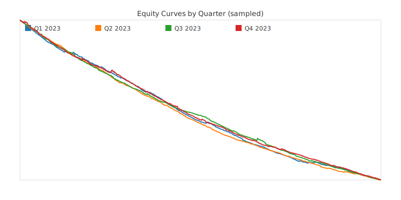
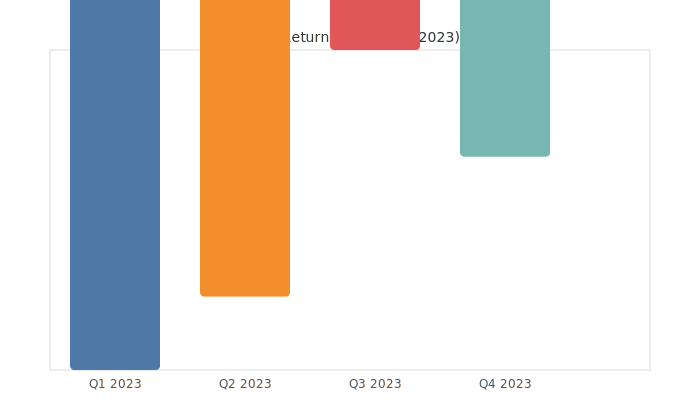
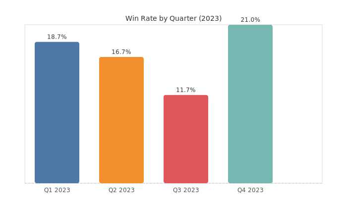

# AMI Predict — Prediction Engines and Modeling Toolkit

AMI Predict is a modular toolkit for building prediction engines on time series and event-driven data. It includes data ingestion, feature engineering, model training (deep learning and gradient boosting), backtesting, simulation, and optional dashboard/execution integrations.

## Key Capabilities

- Data providers for historical and live feeds
- Feature pipelines for classical and microstructure signals
- Model trainers: PyTorch, LightGBM, CatBoost, scikit-learn
- Backtesting, metrics, regime detection
- Simulation engine for what-if and stress testing
- Optional web dashboard (Next.js)

## Install

```bash
git clone git@github.com:Independent-AI-Labs/AMI-PREDICT.git
cd AMI-PREDICT
python -m venv .venv && source .venv/bin/activate
pip install -r requirements.txt
```

## Quickstart

See full docs under `docs/` or try the snippet below:

```python
from pathlib import Path

from src.data_providers.data_sync import DataSync
from src.ml.feature_engineering import build_basic_features
from src.ml.models import train_lightgbm_classifier
from src.ml.backtester import Backtester

base = Path(__file__).resolve().parent
example = base / "data" / "parquet" / "BTC_USDT" / "2020" / "BTC_USDT_2020_08.parquet"

df = DataSync.read_parquet_file(example)
X, y = build_basic_features(df)
model, metrics = train_lightgbm_classifier(X, y)
bt = Backtester(model=model)
results = bt.run(df)
print(metrics)
print(results.summary())
```

Run examples:

```bash
python docs/quickstart_example.py
```

## Benchmark Results (2023)

- Source: `experiments/backtest_AttentionTCN_*.json` (Q1–Q4 2023)
- Strategy: AttentionTCN model signals backtested on BTC/USDT minute data

Highlights:
- Consistently negative total returns across quarters; low win rates
- Confirms disconnect between classification accuracy and tradable signals

Pictures:

- Equity curves (sampled per quarter):

  

- Total return by quarter:

  

- Win rate by quarter:

  

How to regenerate charts
------------------------

- Ensure experiment JSONs exist under `experiments/`.
- Run the renderer (no external dependencies):

```bash
uv run python scripts/render_bench_charts.py
```

Charts are written to `docs/assets/`.

## Documentation

- docs/index.md — Overview
- docs/quickstart.md — Quickstart
- docs/concepts/* — Concepts: data providers, features, models, backtesting, simulation, configuration
- docs/guides/* — Guides: custom providers, training, acceleration, experiment tracking, dashboard
- docs/api — API reference plan

## Acceleration (Optional)

Deep learning models can leverage Intel XPU. See `docs/guides/acceleration-xpu.md`.

## License

Copyright Independent AI Labs
